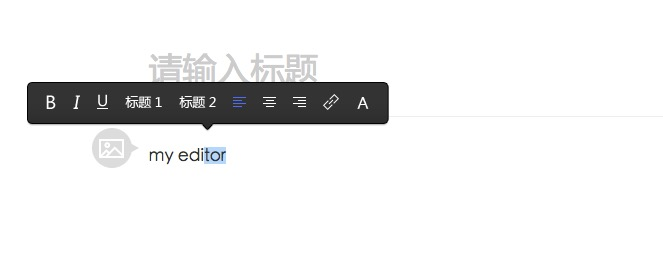

iWo
===

iWoEditor is a WYSIWYG editor like MediumEditor,the editor core is simple and extensible.

You can very easy to write plugin for iWoEditor,we also provide many basic plugins for it.

It supported IE6-11 and Chrome,Firefox,Safari latest version.

<b>The current version is not available, is still in development.</b>

--

--

## Usage

```html
<script src="iwo.loader.min.js"></script>
<div id="editor"></div>
```

```javascript
var editorDiv = document.getElementById('editor');
var configs = {
  themePath:'path/to/themePath',
  theme:'default',
  pluginPath:'path/to/plugins',
  plugins:iwo.base
  //plugins:'bold,italic,underline,justify,color,link,toolbar,image,video,music,http://my.domain/path/to/someplugin.js'
};
var iwoEditor = iwo.create(editorDiv,configs);
```

## Api

[Methods](docs/methods.md),[Attribute](docs/attribues.md),[Events](docs/events.md)

## Contributors

```
 project  : iWo
 repo age : 6 days
 active   : 3 days
 commits  : 27
 files    : 20
 authors  : 
    26  Xiaojue                 96.3%
     1  LIU LUYING              3.7%
```

## Git hooks 

```bash
./setup-hooks.sh
```

## License

[WTFPL](LICENSE)
